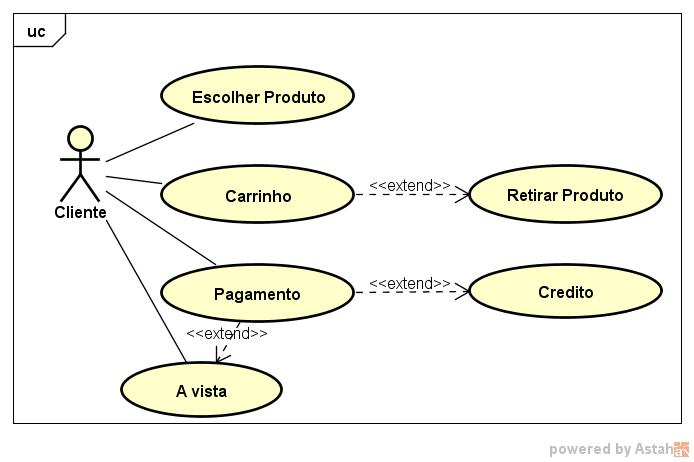
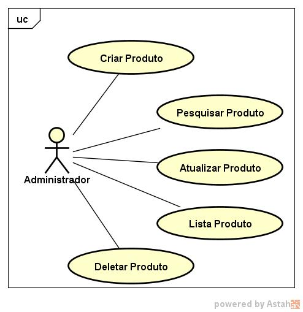
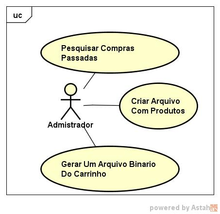

# Sistema De Compras Com Carrinho - C Project CRUD

## Version

Version: 1.0

## Sobre o Mini-Projeto

Este mini-projeto feito em linguagem C, foi desenvolvido como trabalho final para a disciplina de programação estruturada da faculdade. A ideia era trabalhar todos os conhecimentos adiquiridos durante o semestre.
Dentre eles:
 - Variáveis e Constantes
 - Funções
 - Structs
 - Arrays
 - Arquivos binários e texto
 - Validações
 - CRUD

## Casos de Uso do Mini-Projeto

|CLIENTE|
| ----------- |

Nesse caso de uso o cliente pode escolher produtos cadastrados anteriormente pelo administrador, onde vai ser mostrado código do produto,nome do produto e valor. Sendo assim a opção de adicionar o item no carrinho, com a possibilidade de retirar o produto inserindo o código do produto, com isso ao fim da escolha dos produtos, escolher a forma de pagamento sendo credito ou a vista, sendo a vista possuindo um desconto,depois da confirmação do pagamento será gerado um arquivo de texto com os produtos comprados por esse cliente, para consultas futuras.

|ADMINISTRADOR|
| ----------- |

Nesse caso de uso o administrador pode criar um produto sendo solicitado para o mesmo o código da mercadoria que deve ser único,nome do produto e valor,sendo possível também pesquisar um produto especifico,possível quando necessário, a atualização de dados sobre o mesmo não sendo permitido a troca do código do produto assim como também a listagem de todos as mercadorias cadastradas, como a possibilidade de remover um produto da lista.

|ADMINISTRADOR - Arquivo|
| ----------- |

Nesse caso de uso o administrador pode listar compras de clientes passados que foram guardados em arquivos, digitando o nome do arquivo como por exemplo o CPF do cliente ou o nome ,sendo possível também criar um arquivo onde será guardado os produtos cadastrados, com isso a opção de gerar um arquivo binário com a compra atual do cliente.

## Ferramentas utilizadas
 - Dev-C++
 - Git e Github
 - Astah Community

## Autor

* **Gabriel Alves** - *Student* - [Linkedin](https://www.linkedin.com/in/gabriel-alves-de-paulo/)

## Licença

[MIT](https://opensource.org/licenses/mit-license.php) &copy; Gabriel Alves - Brasil

## Obrigado!